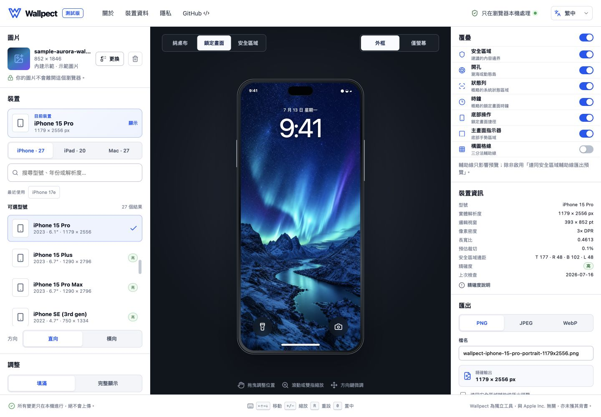
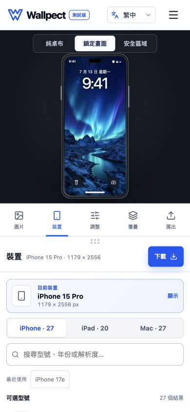

<div align="center">

# Wallpect

**以私隱為先的 Apple 裝置桌布預覽與適配工具。**

[立即使用](https://wallpect.k-y.cc) · [English](README.md) · [技術文件](#技術文件)

[](https://github.com/kyeunga25/wallpect/actions/workflows/ci.yml)
[](https://github.com/kyeunga25/wallpect/releases/latest)
[](LICENSE)
[](https://wallpect.k-y.cc)

</div>



Wallpect 讓你按所選 Apple 裝置調整圖片構圖、檢查可能遮擋內容的系統介面，並以設定檔的精確像素尺寸匯出桌布。圖片解碼、編輯、預覽及匯出全部在瀏覽器內完成；沒有圖片上傳端點、帳戶系統或第三方圖片分析。

## 可以做甚麼

| 檢查                                                         | 構圖                                               | 匯出                                               |
| ------------------------------------------------------------ | -------------------------------------------------- | -------------------------------------------------- |
| 檢查長寬比、開孔、安全區域、鎖定畫面、選單列及 Dock 輔助線。 | 拖曳、縮放、平移、旋轉、填滿、完整顯示或延伸圖片。 | 按所選設定檔的實體像素尺寸下載 PNG、JPEG 或 WebP。 |

### 主要功能

- 74 個設定檔：27 個 iPhone、20 個 iPad，以及 27 個 Mac／顯示器，涵蓋 2021 年至 2026 年 7 月要求支援的所有顯示系列
- 在本機解碼 PNG、JPEG 與 WebP，限制為 30 MB、最長邊 12,000 px 及 7,200 萬像素
- 每部裝置分別保存直向及橫向構圖
- 純色、透明或模糊延伸背景
- 預覽與匯出共用相同的變換及 Canvas 渲染計算
- 響應式桌面與流動版工作區
- 預設繁體中文，並支援簡體中文及英文
- 首次載入正式版本後可離線快取應用程式外殼
- 清楚標示公開、推算及估算裝置資料的準確度

## 立即試用

1. 開啟 [wallpect.k-y.cc](https://wallpect.k-y.cc)。
2. 使用內建示範圖片，或從裝置選擇圖片。
3. 選擇裝置設定檔及方向。
4. 調整構圖，並開啟需要檢查的輔助線。
5. 選擇 PNG、JPEG 或 WebP，再按顯示的解析度匯出。

圖片只會保存在瀏覽器記憶體，當圖片被取代、頁面重新整理或關閉時便會釋放。只有介面語言及最多四個最近使用的裝置識別碼會儲存在版本化 `localStorage`；公開網站檔案的正常請求仍會經過 Cloudflare，但不包含你選擇的圖片 bytes。

網站內可直接查閱繁中／英文的私隱、使用條款、免責及資料來源說明。維護與新增第三方來源／API 的規則記錄於 [條款、私隱與資料政策](docs/LEGAL_PRIVACY_AND_DATA_POLICY.md)。

<p align="center">
  
</p>

## 準確度原則

Wallpect 將公開的顯示資料與需要量度或推算的幾何資料分開處理：

- 所選設定檔決定匯出像素尺寸及長寬比。
- 裝置外框及系統覆疊只是構圖輔助線，並非 Apple 官方渲染畫面。
- 每個設定檔均標示準確度；初始資料集刻意標記為 `high` 而非 `verified`，因為大部分遮擋幾何均為推算值。
- iOS、iPadOS 及 macOS 仍可能套用系統層級的縮放、延伸、景深或填滿行為。

完整定義及資料問題回報要求請參閱[準確度政策](docs/ACCURACY_POLICY.md)。

## 本機開發

需求：Node.js 22 或更新版本，以及 npm。

```bash
git clone https://github.com/kyeunga25/wallpect.git
cd wallpect
npm ci
npm run dev
```

執行主要品質檢查：

```bash
npm run check
npm run format:check
npm run worker:check
```

Playwright 測試另外涵蓋 Chromium、WebKit、Microsoft Edge 及 Firefox：

```bash
npm run test:e2e
```

設定 `PLAYWRIGHT_BASE_URL` 後，可對已部署的 Workers 預覽版本或正式網站執行相同的瀏覽器矩陣。

## 部署與版本發布

Wallpect 以不含 Worker script 的 Cloudflare Workers Static Assets 模式部署，並由 Worker 以 Custom Domain 直接管理 `wallpect.k-y.cc`。推送至 `main` 會觸發正式 Workers Build；其他分支只會建立預覽版本，不會改變正式流量。正式回退使用 Workers 版本記錄，不再需要 Cloudflare Pages 專案。

平台設定請參閱[部署指南](docs/DEPLOYMENT.md)；版本、驗證、預覽、正式部署及回退程序請參閱[發布指南](docs/RELEASING.md)。

## 架構

| 路徑               | 職責                                        |
| ------------------ | ------------------------------------------- |
| `src/components`   | 編輯器面板、控制項及裝置預覽介面            |
| `src/state`        | 編輯器狀態、各裝置的構圖變換及偏好          |
| `src/core`         | 適配、變換、驗證、Canvas 渲染及匯出         |
| `src/data/devices` | 放在 UI 以外、以資料驅動的 Apple 裝置設定檔 |
| `src/i18n`         | 語言選擇、偏好保存及翻譯                    |
| `tests`            | 單元、整合及端對端測試                      |

預覽與匯出均會呼叫 `renderWallpaper`。平移值使用目標 Canvas 的標準化座標，因此縮小預覽與完整解析度匯出可保持相同構圖。

## 技術文件

- [準確度政策](docs/ACCURACY_POLICY.md)
- [裝置設定檔指南](docs/DEVICE_PROFILE_GUIDE.md)
- [部署指南](docs/DEPLOYMENT.md)
- [發布指南](docs/RELEASING.md)
- [條款、私隱與資料政策](docs/LEGAL_PRIVACY_AND_DATA_POLICY.md)
- [版本記錄](CHANGELOG.md)

## 參與貢獻

歡迎提交 issue 及範圍清晰的 pull request。修改裝置資料、渲染行為或涉及私隱的程式碼前，請先閱讀 [CONTRIBUTING.md](CONTRIBUTING.md)。

## 授權及聲明

Wallpect 採用 [MIT License](LICENSE)。

Wallpect 是獨立工具，與 Apple Inc. 無關，亦未獲其背書。Apple 產品名稱只用於識別相容的裝置設定檔。

裝置規格由連結的公開製造商支援頁面人工整理；Wallpect 不會在執行時使用 Apple 或第三方裝置資料 API，也不會自動擷取或鏡像 Apple 網站內容。詳細限制及資料治理方法見 [條款、私隱與資料政策](docs/LEGAL_PRIVACY_AND_DATA_POLICY.md)。
